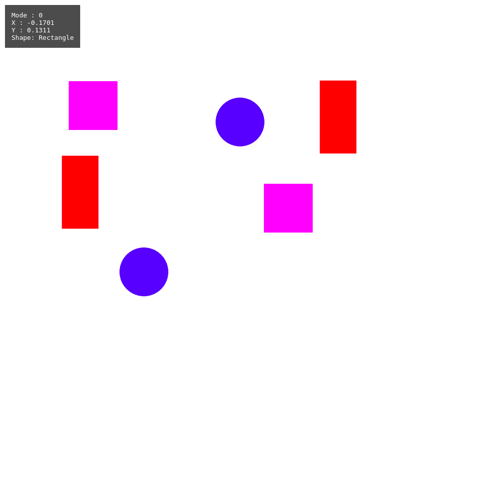
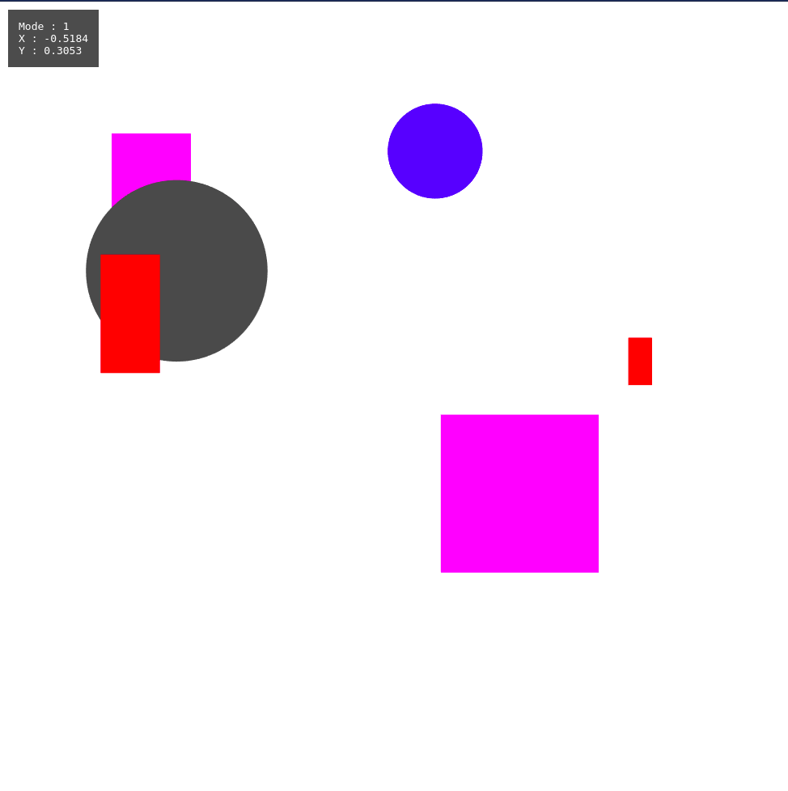
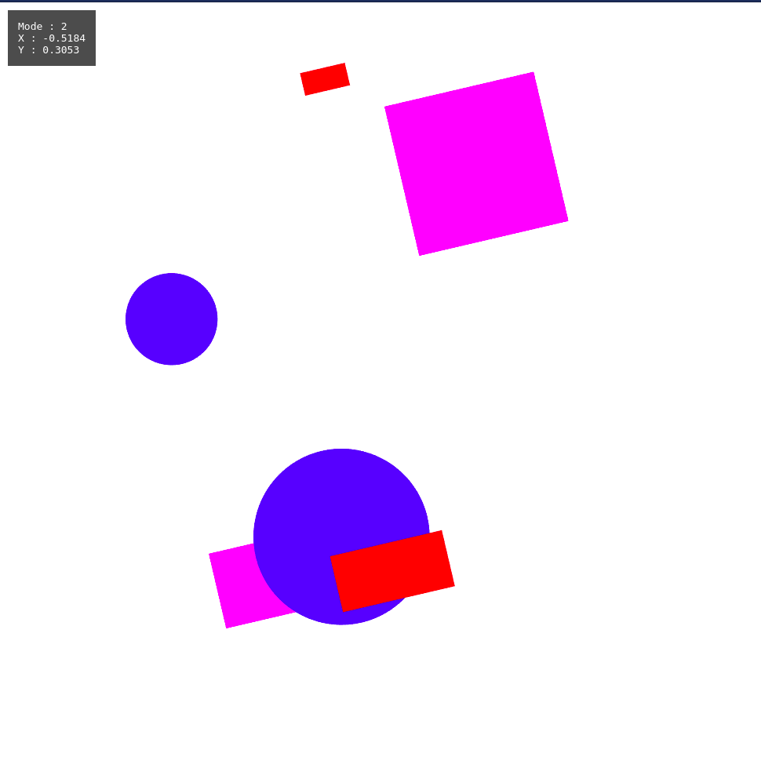

# Basic instructions

Run the program with a live server.
By default the program is in **Mode 0** with shape drawing mode of **rectangle**.
```
To change the mode : Press 'm'

In mode 0:
    To change to-
        rectangle : Press 'r'
        square : Press 's'
        circle : Press 'c'
    To draw any of the figure, click on the canvas whereever you want to draw it

In mode 1:
    To select an object click on it using the left mouse button. 
    Use the arrow keys to move it 
    Use the +/- keys to scale it

In mode 2:
    All the drawn figures are rotated around their common centroid. 
    Use left or right arrow keys to rotate the scene in anti-clockwise or clockwise      
    direction

Pressing m again makes mode 0 and takes you to the previous state i.e. without the rotations. 
```
## Visuals from the Program

*Top left corner we can see the Mode and Shape mode. Using r,s,c to draw the shapes*


*Clicking on an object to select it and using arrow, +, - keys to transform and scale it. Selected Circle can be seen as shaded in gray*


*Using the left and right arrow keys to rotate the scene about centroid about 90 degress approx*

# File Structure

- Source
  - Renderer.js
  - Shader.js
  - vertex.js
  - fragment.js
  - transform.js
  - Rectangle.js
  - Circle.js
  - index.js
  - index.html
  - globalStyle.css
- Report : Contains my observations, approach, conclusions from this project
- VideoReport.mp4 : MP4 video containing the demo
- Mode0.png : Contains a screenshot of the program in Mode 0
- Mode1.png : Contains a screenshot of the program in Mode 1
- Mode2.png : Contains a screenshot of program in Mode 2 with the scene rotated by ~ 90 degrees